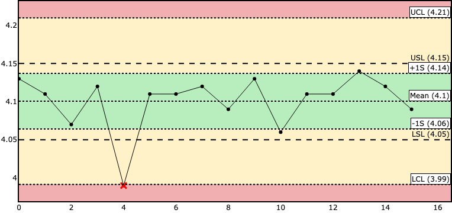

# SPC-Plot
Class to build statistical process control charts using `plotly graph_objs`.

***

Package still in development, but usable as is

Additionally, the `AnomalyDetector` was modified from [this project](https://github.com/omerfarukozturk/AnomalyDetection).

***

### How to use

```
import pandas as pd
import spc

# dummy data
data = (
    (4.13, '2022-01-29', 'NBELINSKI','None'),
    (4.11, '2022-01-30', 'DDEVITO', 'None'),
    (4.07, '2022-01-30', 'PSMITH', 'None'),
    (4.12, '2022-01-30', 'ERICHTOFEN', 'None'),
    (3.99, '2022-01-31', 'DDEVITO', 'Humidity out of tolerance'),
    (4.11, '2022-01-31', 'PSMITH', 'None'),
    (4.11, '2022-01-31', 'DDEVITO', 'None'),
    (4.12, '2022-02-01', 'DDEVITO', 'None'),
    (4.09, '2022-02-02', 'DDEVITO', 'None'),
    (4.13, '2022-02-02', 'PSMITH', 'None'),
    (4.06, '2022-02-02', 'ERICHTOFEN', 'Extra five minutes in oven'),
    (4.11, '2022-02-02', 'ERICHTOFEN', 'None'),
    (4.11, '2022-02-02', 'PSMITH', 'None'),
    (4.14, '2022-02-02', 'PSMITH', 'None'),
    (4.12, '2022-02-03', 'NBELINSKI', 'None'),
    (4.09, '2022-02-03', 'TMASAKI', 'None')
)
cols = ('Width (mm)', 'Date of Manufacture', 'Operator', 'Comments')
df = pd.DataFrame(data, columns=cols)


# create Plot object, calculates statistics
# and violations on construction
chart = Plot(df, y='Width (mm)', fig_layout='light',
           spec_limits={'USL':4.15,'LSL':4.05})

chart.LCL, chart.mean, chart.UCL
>> (3.99137185359222, 4.100625000000001, 4.209878146407782)
```

Generating plots:

```
chart.draw_scatter()
chart.draw_spc_zones()
chart.draw_lines(show_value=True)
chart.draw_violations()

chart.fig
>>
```


Process Capability & Violations (Functionality not tested in recent update, may be broken)
```
chart.capability()
>>
{'mean': 4.100625000000001,
 'LCL': 3.99137185359222,
 'UCL': 4.209878146407782,
 'Process Width': 0.21850629281556166,
 'LSL': 4.05,
 'USL': 4.15,
 'Spec Width': 0.10000000000000053,
 'Cp Lower': 0.4633733825023789,
 'Cp Upper': 0.4519320644158867,
 'Cp': 0.45765272345913277}
 
 chart.violations
 >>
 4    [1]
Name: violations, dtype: object
```
The violations attribute is a `pandas.Series` object with the violating record's
index pointing to a list of the rules violated.
